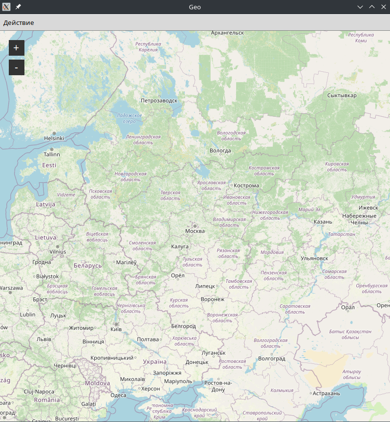
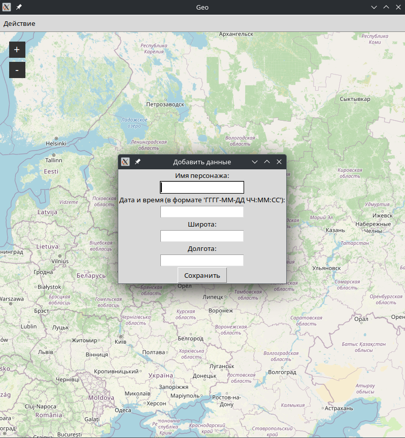
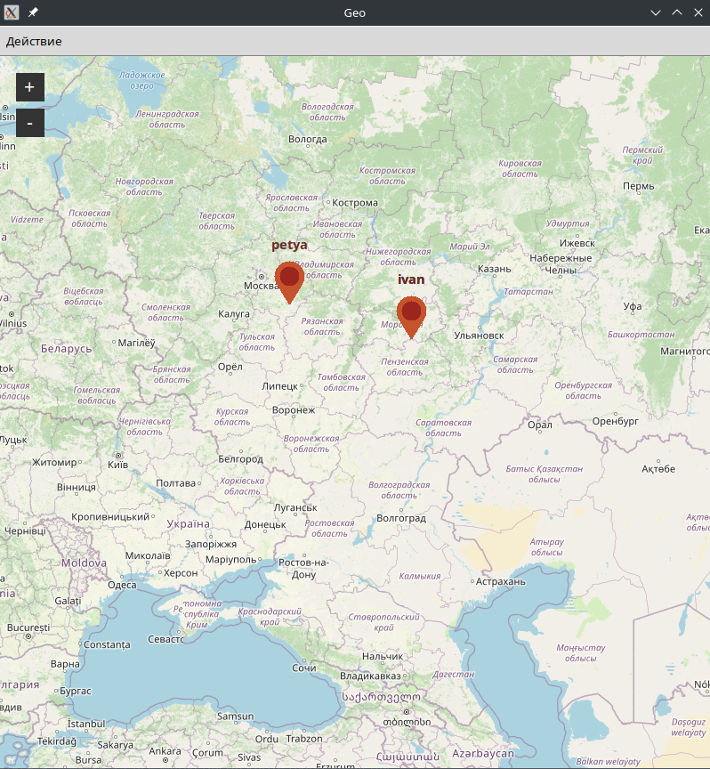
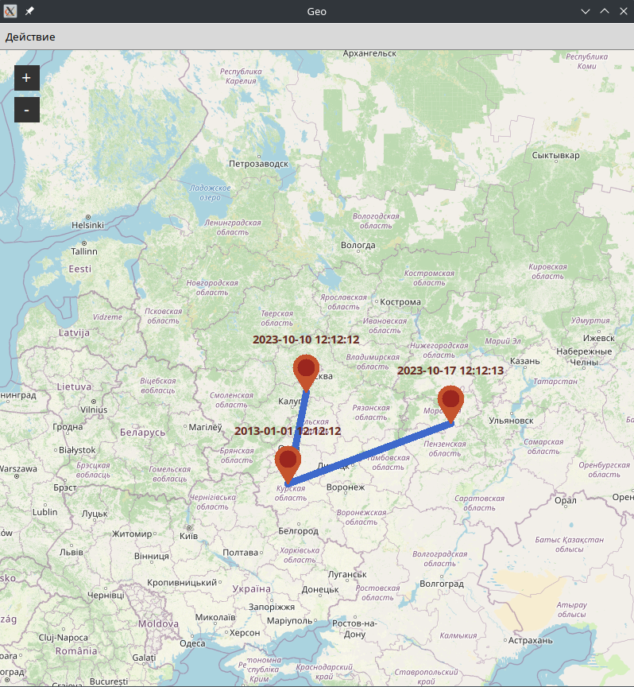

# 1c_task

Цифровизация дошла и до вселенной “Властелина колец”. Гендальф хочет себе
приложение, с помощью которого сможет на карте отслеживать местоположение
всех участников братства Кольца.
Вам необходимо разработать приложение, в котором Гендальф сможет:

● Добавлять новых отслеживаемых персонажей

● Для каждого персонажа указывать геометку в формате “Дата - время -
координаты (геопозиция)”

● Смотреть на карте позиции всех персонажей

● Смотреть на карте траектории движения каждого персонажа за определенный
период времени

для запуска 

pip install -r requirements.txt

python3 main.py